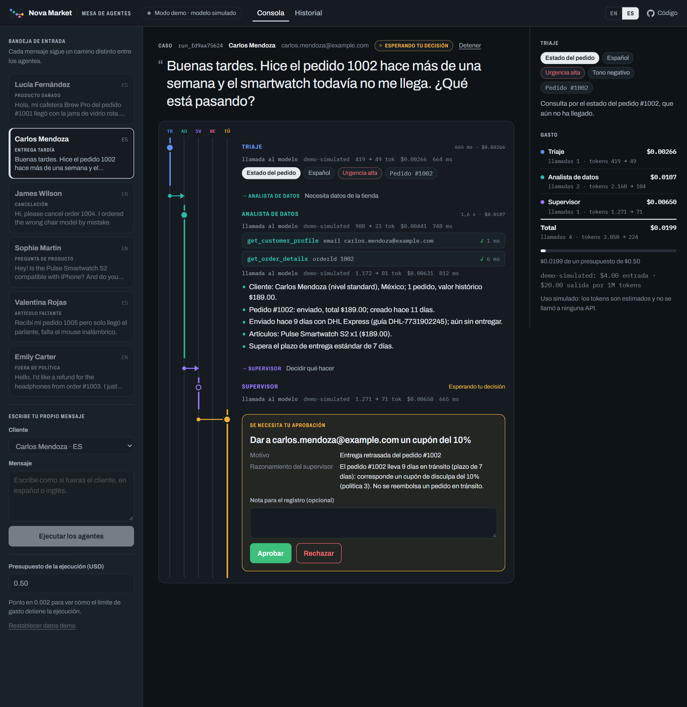
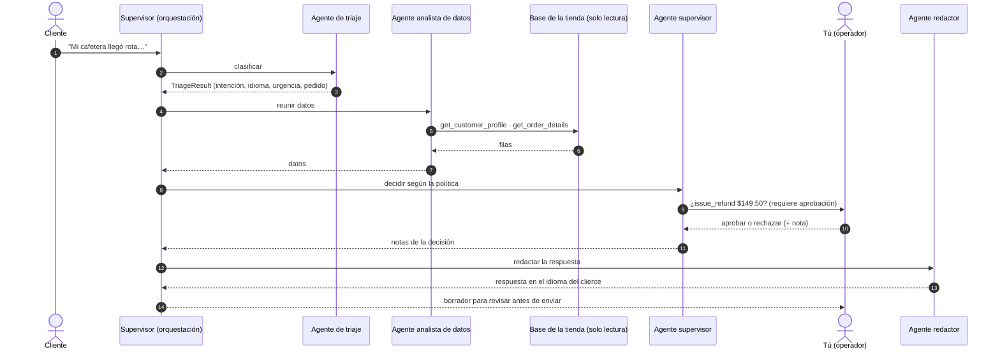
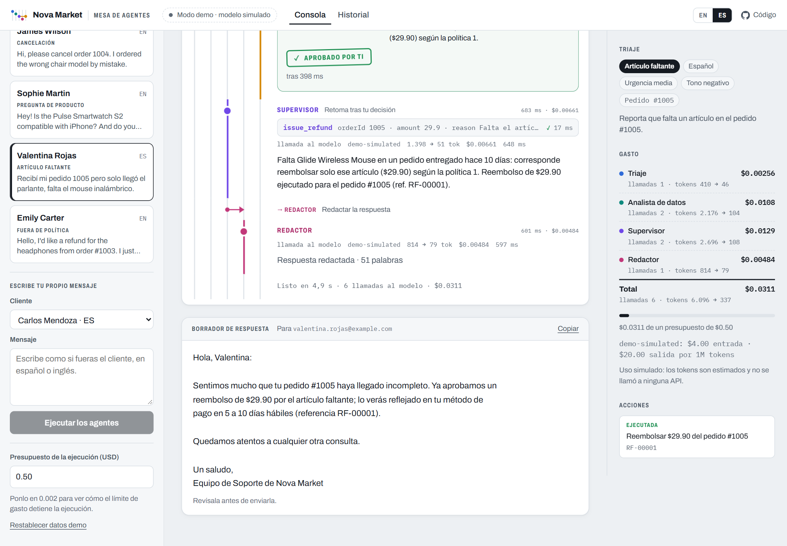
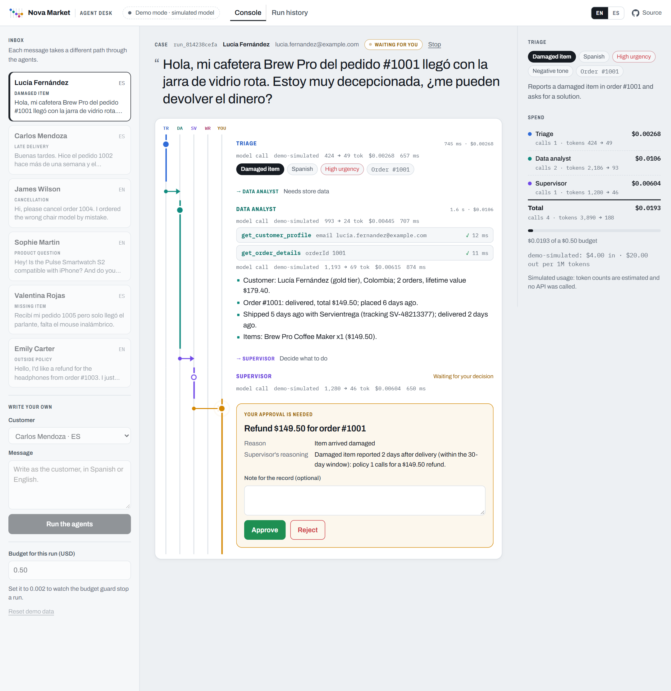
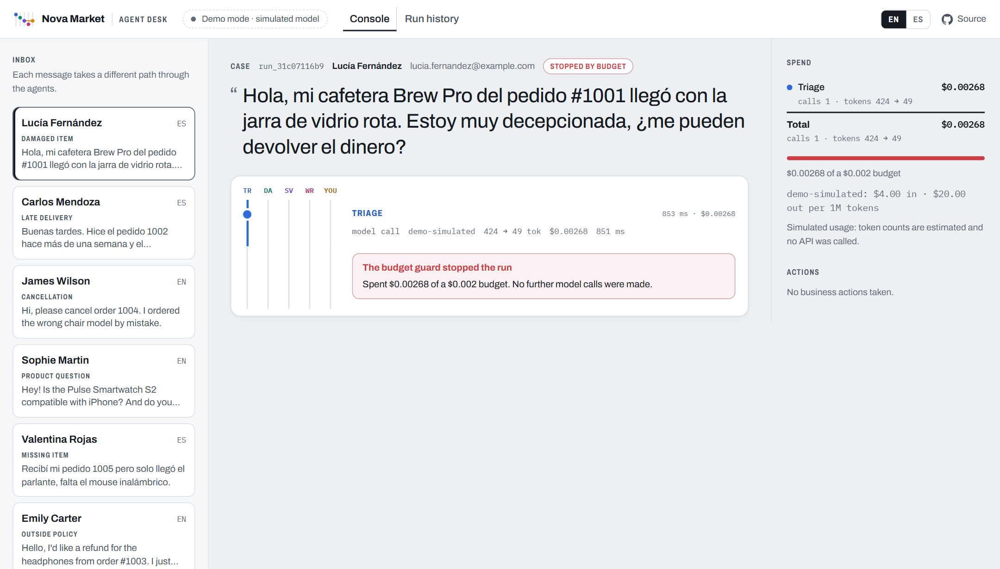
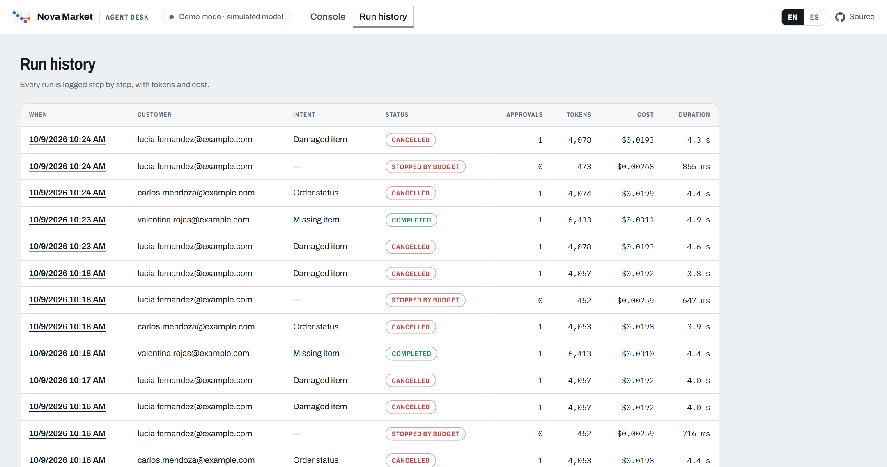

<p align="right"><a href="README.md">English</a> · <strong>Español</strong></p>

# Agent Desk: soporte al cliente multiagente en .NET

[](https://github.com/MateoVH/AIAgentDemo/actions/workflows/ci.yml)


Cuatro agentes de IA construidos con **Microsoft Agent Framework** atienden cada mensaje de los clientes de una tienda
en línea ficticia, Nova Market: un agente de **triaje** lo clasifica, un **analista de datos** consulta una base SQL con
herramientas, un **supervisor** aplica la política del negocio y un **redactor** escribe la respuesta en el idioma del
cliente. Todo lo que mueva dinero **espera la aprobación de una persona**, cada paso queda registrado y cada llamada al
modelo se mide contra un presupuesto por ejecución.



> **Funciona sin API key.** Por defecto usa un modelo demo incluido: reglas deterministas que recorren exactamente el
> mismo camino que un LLM (salida JSON tipada, llamadas a herramientas, pausas de aprobación, medición de tokens). Con un
> solo ajuste se conecta a Claude, OpenAI, Azure OpenAI u Ollama.

## Por qué este proyecto

Las vacantes de desarrollo de agentes de IA piden una y otra vez lo mismo: **herramientas**, **coordinación entre
agentes** y **supervisión humana**. Este repositorio muestra las tres cosas de punta a punta en .NET, junto con lo que un
sistema en producción necesita alrededor: control de costos, trazabilidad, reglas de negocio aplicadas en código, pruebas e integración continua.

## Funcionalidades

| | |
|---|---|
| **Orquestación multiagente** | Un supervisor coordina cuatro `ChatClientAgent` especializados. El enrutamiento vive en el código (predecible y testeable); el criterio vive en los agentes. Las consultas informativas se saltan por completo el paso de decisión. |
| **Herramientas sobre SQL** | Herramientas de solo lectura (`get_order_details`, `search_products`, …) y una herramienta de texto a SQL protegida: validador de sentencias, conexión SQLite con `Mode=ReadOnly` y límite de filas. |
| **Humano en el circuito** | Reembolsos, cupones y cancelaciones son `ApprovalRequiredAIFunction`. El ciclo de herramientas se pausa, el operador aprueba o rechaza en la interfaz y el agente continúa en la misma `AgentSession`. |
| **Salida estructurada** | El triaje devuelve un `TriageResult` tipado con `agent.RunAsync<TriageResult>()`; el esquema JSON se genera desde el tipo de C#. |
| **Control de tokens y costos** | Un `DelegatingChatClient` debajo del ciclo de invocación de funciones mide cada ida y vuelta al modelo: tokens y USD por agente, verificación previa del presupuesto y corte inmediato. |
| **Trazabilidad y observabilidad** | Cada paso es un evento: se transmite en vivo a la interfaz, se guarda en SQLite (historial), se registra en logs y se exporta como trazas y métricas de OpenTelemetry. |
| **Reglas en el código** | Las acciones solo aplican al cliente del caso, los reembolsos no superan lo pagado, los pedidos enviados no se cancelan y el texto del cliente se aísla como entrada no confiable. |
| **Bilingüe (ES/EN)** | Interfaz localizada con `IStringLocalizer` y archivos resx. Los agentes responden en el idioma del cliente y escriben las notas internas en el del operador. |
| **Independiente del proveedor** | Claude (SDK oficial de Anthropic), OpenAI, Azure OpenAI, Ollama o el modelo demo sin conexión, todos detrás de `IChatClient`. |
| **Con pruebas** | 54 pruebas con xUnit, incluidas ejecuciones completas del flujo de agentes con aprobaciones, rechazos, cortes por presupuesto y un proveedor que rechaza la salida estructurada. CI con GitHub Actions. |

## Cómo fluye una ejecución



Todos los agentes hablan con el modelo a través de la misma cadena de middleware:

```text
ChatClientAgent            vincula cada aprobación con la solicitud que se mostró
└─ FunctionInvokingChatClient       ciclo de herramientas, máximo 6 idas y vueltas por llamada
   └─ UsageTrackingChatClient       presupuesto · tokens · USD · latencia → evento de la ejecución
      └─ OpenTelemetryChatClient    spans y métricas GenAI
         └─ IChatClient             Anthropic · OpenAI · Azure OpenAI · Ollama · Demo
```

La ida y vuelta de la aprobación, resumida de [`SupportSupervisor`](src/AIAgentDemo.Core/Orchestration/SupportSupervisor.cs):

```csharp
var session = await agent.CreateSessionAsync(ct);
var response = await agent.RunAsync(prompt, session, cancellationToken: ct);

// Las herramientas que requieren aprobación vuelven como solicitudes en lugar de ejecutarse.
foreach (var request in response.Messages.SelectMany(m => m.Contents).OfType<ToolApprovalRequestContent>())
{
    var decision = await approvals.RequestApprovalAsync(..., ct);   // la tarjeta en la interfaz espera al operador
    answers.Add(request.CreateResponse(decision.Approved, decision.Note));
}

// Misma sesión: la herramienta se ejecuta (o se reporta como rechazada) y el agente termina su decisión.
response = await agent.RunAsync(new ChatMessage(ChatRole.User, answers), session, cancellationToken: ct);
```

## Inicio rápido

Requiere el [SDK de .NET 10](https://dotnet.microsoft.com/download).

```bash
git clone https://github.com/MateoVH/AIAgentDemo.git
cd AIAgentDemo
dotnet run --project src/AIAgentDemo.Web
```

Abre http://localhost:5227 y elige un mensaje de la bandeja de entrada. Sin una clave configurada funciona en **modo demo**.
Los datos de la tienda se restablecen en cada inicio, y el enlace **Restablecer datos demo** los recupera en cualquier momento.

### Usar un modelo real

Guarda las claves en [user secrets](https://learn.microsoft.com/aspnet/core/security/app-secrets) o en variables de entorno, nunca en `appsettings.json`:

```bash
cd src/AIAgentDemo.Web
dotnet user-secrets set "AI:Provider" "Anthropic"
dotnet user-secrets set "AI:Anthropic:ApiKey" "<tu-clave>"
```

| Proveedor | Ajustes | Modelo por defecto |
|---|---|---|
| `Anthropic` | `AI:Anthropic:ApiKey` (o `ANTHROPIC_API_KEY`) | `claude-opus-5-5` |
| `OpenAI` | `AI:OpenAI:ApiKey` (o `OPENAI_API_KEY`) | `gpt-5-mini` |
| `AzureOpenAI` | `AI:AzureOpenAI:Endpoint`, `AI:AzureOpenAI:ApiKey`, `AI:AzureOpenAI:Model` (nombre del deployment) | `gpt-5-mini` |
| `Ollama` | `AI:Ollama:Endpoint`, `AI:Ollama:Model` | `qwen3:8b` |
| `Demo` | ninguno | simulado |

Con `AI:Provider` en `Auto` (el valor por defecto) la aplicación usa Claude si encuentra una clave de Anthropic, luego
OpenAI, luego Azure OpenAI y, si no hay ninguna, el modelo demo. Cada agente puede usar su propio modelo con
`AI:Agents:<Agente>:Model`, por ejemplo uno más pequeño para el triaje y la redacción.

## Prueba estos escenarios

| Mensaje de la bandeja | Qué pasa |
|---|---|
| Lucía (ES): su cafetera llegó rota | Reembolso de $149.50, **espera tu aprobación** |
| Carlos (ES): smartwatch con 9 días en tránsito | Cupón de disculpa del 10%, **espera tu aprobación** |
| James (EN): cancelar una silla que no se ha enviado | Cancelación, **espera tu aprobación** |
| Sophie (EN): "¿es compatible con iPhone?" | Consulta del catálogo; se omite el paso de decisión (sin llamada al modelo) |
| Valentina (ES): falta el mouse en la caja | Reembolso solo del artículo faltante, espera aprobación |
| Emily (EN): reembolso 45 días después de la entrega | Rechazado por política; no hay nada que aprobar |

Después prueba rechazar una acción con una nota, poner el presupuesto en `0.002` para ver cómo el límite de gasto detiene
una ejecución, cambiar la interfaz a inglés o escribir tu propio mensaje. Puedes intentar inyecciones de prompt: las
acciones están protegidas en el código.

<p>
  
  
</p>
<p>
  
  
</p>

## Control de costos

- **Por llamada.** `UsageTrackingChatClient` está *debajo* del ciclo de herramientas, así que ve cada ida y vuelta,
  incluidas las adicionales que hace un solo `RunAsync` mientras llama herramientas. El consumo lo reporta el proveedor
  (`UsageDetails`) y se valora con `Pricing:Models` de `appsettings.json` (USD por 1M de tokens, admite precio de entrada
  en caché y coincidencia por prefijo más largo del nombre del modelo).
- **Por ejecución.** `RunBudget` rechaza una llamada cuya entrada estimada ya superaría el presupuesto (antes de llamar) y
  detiene la ejecución en cuanto el gasto registrado lo supera (después de llamar). Por defecto: $0.50 y 200 mil tokens
  por ejecución; la consola permite cambiarlo en cada ejecución.
- **Por diseño.** El enrutamiento omite agentes innecesarios, cada agente tiene su propio `MaxOutputTokens` y esfuerzo de
  razonamiento, el ciclo de herramientas tiene un tope y cualquier agente puede usar un modelo más barato.

## Reglas de protección

1. **El SQL que escribe un agente se valida y corre en solo lectura.** Una sola sentencia `SELECT`/`WITH`, sin
   comentarios, sin palabras de escritura, DDL ni `PRAGMA`, y la conexión SQLite se abre con `Mode=ReadOnly`: aunque el
   validador fallara, no podría escribir. Máximo 50 filas por consulta.
2. **Las reglas de negocio viven en las herramientas de acción,** no solo en el prompt: solo se actúa sobre pedidos del
   cliente del caso, los reembolsos no superan lo pagado, las cancelaciones solo antes del envío y los cupones van del 5% al 25%.
3. **Una persona aprueba las herramientas que mueven dinero** (configurable en `Approval:RequiredFor`). Agent Framework
   vincula cada aprobación con la llamada exacta que se mostró; las solicitudes sin respuesta se rechazan tras un tiempo límite.
4. **El texto del cliente se aísla como entrada no confiable** dentro de etiquetas `<customer_message>`, y cada agente
   tiene instrucciones de tratarlo solo como datos.
5. **La respuesta es un borrador** que el operador revisa antes de que llegue al cliente.

## Estructura del proyecto

```text
src/
  AIAgentDemo.Core/        Agentes, orquestación, herramientas, control de costos, base SQLite, proveedores
    Agents/                Instrucciones y SupportAgentFactory (un ChatClientAgent por rol)
    Orchestration/         SupportSupervisor, aprobaciones, modelo de triaje, prompts
    Tools/                 Herramientas de datos y de acción, SqlGuard, trazado de herramientas
    Costs/                 PricingCatalog, RunBudget, UsageTrackingChatClient
    Providers/             Fábrica de IChatClient (Anthropic, OpenAI, Azure OpenAI, Ollama) y el modelo demo
    Data/, Tracing/        Esquema, datos semilla y consultas; eventos de ejecución y registro en SQLite
  AIAgentDemo.Web/         Consola Blazor Server (ES/EN): gráfico de la ejecución en vivo, aprobaciones, historial
tests/
  AIAgentDemo.Tests/       xUnit: reglas de protección, precios, herramientas y ejecuciones completas de agentes
```

## Observabilidad

Define `OTEL_EXPORTER_OTLP_ENDPOINT` para exportar trazas y métricas: ejecuciones de agentes, llamadas al modelo con su
consumo de tokens, llamadas a herramientas y costo por agente. Por ejemplo, con el dashboard de .NET Aspire:

```bash
docker run --rm -p 18888:18888 -p 4317:18889 -e DOTNET_DASHBOARD_UNSECURED_ALLOW_ANONYMOUS=true mcr.microsoft.com/dotnet/aspire-dashboard
OTEL_EXPORTER_OTLP_ENDPOINT=http://localhost:4317 dotnet run --project src/AIAgentDemo.Web
```

## Pruebas

```bash
dotnet test
```

Las pruebas de punta a punta ejecutan los agentes, las herramientas y el flujo de aprobación reales contra el modelo demo
y una base SQLite temporal, así que no necesitan API key y corren en CI.

## Tecnologías

.NET 10 · C# · Microsoft Agent Framework 1.24 · Microsoft.Extensions.AI · SDK de Anthropic para .NET · SDK de OpenAI para .NET ·
Blazor Server · SQLite (Microsoft.Data.Sqlite, Dapper) · OpenTelemetry · xUnit · GitHub Actions

## Licencia

MIT. Consulta [LICENSE](LICENSE).
