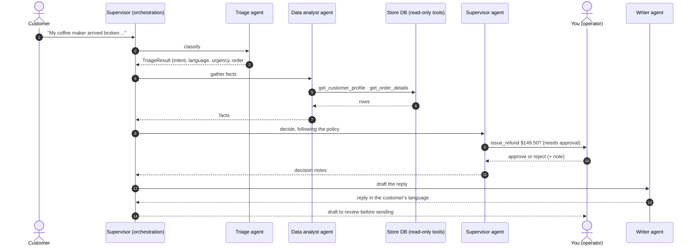

<p align="right"><strong>English</strong> · <a href="README.es.md">Español</a></p>

# Agent Desk: multi-agent customer support in .NET

[](https://github.com/MateoVH/AIAgentDemo/actions/workflows/ci.yml)


Four AI agents built with **Microsoft Agent Framework** work every customer message for a fictional online store, Nova Market:
a **triage** agent classifies it, a **data analyst** queries a SQL database through tools, a **supervisor** applies the
business policy, and a **writer** drafts the reply in the customer's language. Anything that moves money **waits for a
human to approve it**, every step is logged, and every model call is metered against a per-run budget.


> **Runs without an API key.** Out of the box it uses a built-in demo model: deterministic rules that travel the exact
> same path as an LLM (typed JSON output, tool calls, approval pauses, token metering). One setting switches it to
> Claude, OpenAI, Azure OpenAI or Ollama.

## Why this project

Job posts for AI agent developers keep asking for the same three things: **tools**, **coordination between agents** and
**human supervision**. This repo shows all three end to end in .NET, plus what a production system needs around them:
cost control, an audit trail, guardrails enforced in code, tests and CI.

## Features

| | |
|---|---|
| **Multi-agent orchestration** | A supervisor coordinates four specialized `ChatClientAgent`s. Routing lives in code (predictable and testable); judgment lives in the agents. Informational requests skip the decision step entirely. |
| **Tools over SQL** | Read-only tools (`get_order_details`, `search_products`, …) plus a guarded text-to-SQL tool: statement validator, `Mode=ReadOnly` SQLite connection and a row cap. |
| **Human in the loop** | Refunds, coupons and cancellations are `ApprovalRequiredAIFunction`s. The tool loop pauses, the operator approves or rejects in the UI, and the agent resumes on the same `AgentSession`. |
| **Structured output** | Triage returns a typed `TriageResult` via `agent.RunAsync<TriageResult>()`; the JSON schema is generated from the C# type. |
| **Token and cost control** | A `DelegatingChatClient` below the function-invocation loop meters every model round-trip: tokens and USD per agent, a pre-flight budget check and a hard stop. |
| **Audit trail and observability** | Every step is an event: streamed live to the UI, persisted to SQLite (run history), logged, and exported as OpenTelemetry traces and metrics. |
| **Guardrails in code** | Actions are scoped to the case's customer, refunds can't exceed what was paid, shipped orders can't be cancelled, and customer text is fenced as untrusted input. |
| **Bilingual (EN/ES)** | UI localized with `IStringLocalizer` and resx files. Agents reply in the customer's language and write internal notes in the operator's. |
| **Provider-agnostic** | Claude (official Anthropic SDK), OpenAI, Azure OpenAI, Ollama or the offline demo model, all behind `IChatClient`. |
| **Tested** | 54 xUnit tests, including end-to-end runs of the agent pipeline with approvals, rejections, budget stops and a provider that rejects structured output. CI on GitHub Actions. |

## How a run flows



Every agent talks to the model through the same middleware pipeline:

```text
ChatClientAgent            binds approval responses to the requests it surfaced
└─ FunctionInvokingChatClient       tool loop, at most 6 model round-trips per call
   └─ UsageTrackingChatClient       budget check · tokens · USD · latency → run event
      └─ OpenTelemetryChatClient    GenAI spans and metrics
         └─ IChatClient             Anthropic · OpenAI · Azure OpenAI · Ollama · Demo
```

The approval round-trip, condensed from [`SupportSupervisor`](src/AIAgentDemo.Core/Orchestration/SupportSupervisor.cs):

```csharp
var session = await agent.CreateSessionAsync(ct);
var response = await agent.RunAsync(prompt, session, cancellationToken: ct);

// Approval-required tools come back as requests instead of running.
foreach (var request in response.Messages.SelectMany(m => m.Contents).OfType<ToolApprovalRequestContent>())
{
    var decision = await approvals.RequestApprovalAsync(..., ct);   // the UI card waits for the operator
    answers.Add(request.CreateResponse(decision.Approved, decision.Note));
}

// Same session: the tool runs (or is reported as rejected) and the agent finishes its decision.
response = await agent.RunAsync(new ChatMessage(ChatRole.User, answers), session, cancellationToken: ct);
```

## Quick start

Requires the [.NET 10 SDK](https://dotnet.microsoft.com/download).

```bash
git clone https://github.com/MateoVH/AIAgentDemo.git
cd AIAgentDemo
dotnet run --project src/AIAgentDemo.Web
```

Open http://localhost:5227 and pick a message from the inbox. With no key configured it runs in **demo mode**.
The store data resets on every start, and the **Reset demo data** link restores it at any time.

### Use a real model

Keep keys in [user secrets](https://learn.microsoft.com/aspnet/core/security/app-secrets) or environment variables, never in `appsettings.json`:

```bash
cd src/AIAgentDemo.Web
dotnet user-secrets set "AI:Provider" "Anthropic"
dotnet user-secrets set "AI:Anthropic:ApiKey" "<your-key>"
```

| Provider | Settings | Default model |
|---|---|---|
| `Anthropic` | `AI:Anthropic:ApiKey` (or `ANTHROPIC_API_KEY`) | `claude-opus-5-5` |
| `OpenAI` | `AI:OpenAI:ApiKey` (or `OPENAI_API_KEY`) | `gpt-5-mini` |
| `AzureOpenAI` | `AI:AzureOpenAI:Endpoint`, `AI:AzureOpenAI:ApiKey`, `AI:AzureOpenAI:Model` (deployment name) | `gpt-5-mini` |
| `Ollama` | `AI:Ollama:Endpoint`, `AI:Ollama:Model` | `qwen3:8b` |
| `Demo` | none | simulated |

With `AI:Provider` set to `Auto` (the default) the app picks Claude when an Anthropic key is present, then OpenAI, then
Azure OpenAI, and otherwise falls back to the demo model. Each agent can use its own model through
`AI:Agents:<Agent>:Model`, for example a smaller model for triage and writing.

## Try these scenarios

| Inbox message | What happens |
|---|---|
| Lucía (ES): her coffee maker arrived broken | Refund of $149.50, **waits for your approval** |
| Carlos (ES): smartwatch 9 days in transit | 10% apology coupon, **waits for your approval** |
| James (EN): cancel a chair that hasn't shipped | Cancellation, **waits for your approval** |
| Sophie (EN): "is it compatible with iPhone?" | Catalog lookup; the decision step is skipped (no model call) |
| Valentina (ES): the mouse is missing from the box | Refund of only the missing item, waits for approval |
| Emily (EN): refund 45 days after delivery | Declined by policy; nothing for a human to approve |

Then try rejecting an action with a note, setting the budget to `0.002` to watch the budget guard stop a run, switching
the UI to Spanish, or writing your own message. Prompt injections are welcome: the actions are guarded in code.

<p>
  
  
</p>
<p>
  
  
</p>

## Cost control

- **Per call.** `UsageTrackingChatClient` sits *below* the tool loop, so it sees every round-trip, including the extra
  ones a single `RunAsync` makes while calling tools. Usage comes from the provider (`UsageDetails`) and is priced from
  `Pricing:Models` in `appsettings.json` (USD per 1M tokens, cached-input price supported, longest-prefix match on model ids).
- **Per run.** `RunBudget` refuses a call whose estimated input alone would cross the budget (pre-flight) and stops the run
  as soon as the recorded spend crosses it (post-flight). Defaults: $0.50 and 200k tokens per run; the console lets you change it for each run.
- **By design.** Routing skips agents that aren't needed, each agent has its own `MaxOutputTokens` and reasoning effort,
  the tool loop is capped, and any agent can be routed to a cheaper model.

## Guardrails

1. **Agent-written SQL is validated and runs read-only.** One `SELECT`/`WITH` statement, no comments, no write, DDL or
   `PRAGMA` keywords, and the SQLite connection is opened with `Mode=ReadOnly`, so even a bypassed validator can't write.
   Results are capped at 50 rows.
2. **Business rules live in the action tools,** not only in the prompt: actions touch only the case customer's orders,
   refunds stay within what was paid, cancellations happen only before shipping, coupons are 5–25%.
3. **Humans approve money-moving tools** (configurable in `Approval:RequiredFor`). Agent Framework binds each approval to
   the exact call that was shown; undecided requests are rejected after a timeout.
4. **Customer text is fenced as untrusted input** inside `<customer_message>` tags, and every agent is told to treat it as data.
5. **The reply is a draft** that the operator reviews before anything reaches the customer.

## Project structure

```text
src/
  AIAgentDemo.Core/        Agents, orchestration, tools, cost tracking, SQLite store, providers
    Agents/                Instructions and SupportAgentFactory (one ChatClientAgent per role)
    Orchestration/         SupportSupervisor, approvals, triage model, prompts
    Tools/                 Data tools, action tools, SqlGuard, tool tracing
    Costs/                 PricingCatalog, RunBudget, UsageTrackingChatClient
    Providers/             IChatClient factory (Anthropic, OpenAI, Azure OpenAI, Ollama) and the demo model
    Data/, Tracing/        Store schema, seed and queries; run events and the SQLite run log
  AIAgentDemo.Web/         Blazor Server console (EN/ES): live run graph, approvals, run history
tests/
  AIAgentDemo.Tests/       xUnit: guardrails, pricing, tools and end-to-end agent runs
```

## Observability

Set `OTEL_EXPORTER_OTLP_ENDPOINT` to export traces and metrics: agent runs, chat calls with token usage, tool calls and
cost per agent. For example, with the .NET Aspire dashboard:

```bash
docker run --rm -p 18888:18888 -p 4317:18889 -e DOTNET_DASHBOARD_UNSECURED_ALLOW_ANONYMOUS=true mcr.microsoft.com/dotnet/aspire-dashboard
OTEL_EXPORTER_OTLP_ENDPOINT=http://localhost:4317 dotnet run --project src/AIAgentDemo.Web
```

## Tests

```bash
dotnet test
```

The end-to-end tests run the real agents, tools and approval flow against the demo model and a throw-away SQLite database,
so they need no API key and run in CI.

## Tech stack

.NET 10 · C# · Microsoft Agent Framework 1.24 · Microsoft.Extensions.AI · Anthropic .NET SDK · OpenAI .NET SDK ·
Blazor Server · SQLite (Microsoft.Data.Sqlite, Dapper) · OpenTelemetry · xUnit · GitHub Actions

## License

MIT. See [LICENSE](LICENSE).
